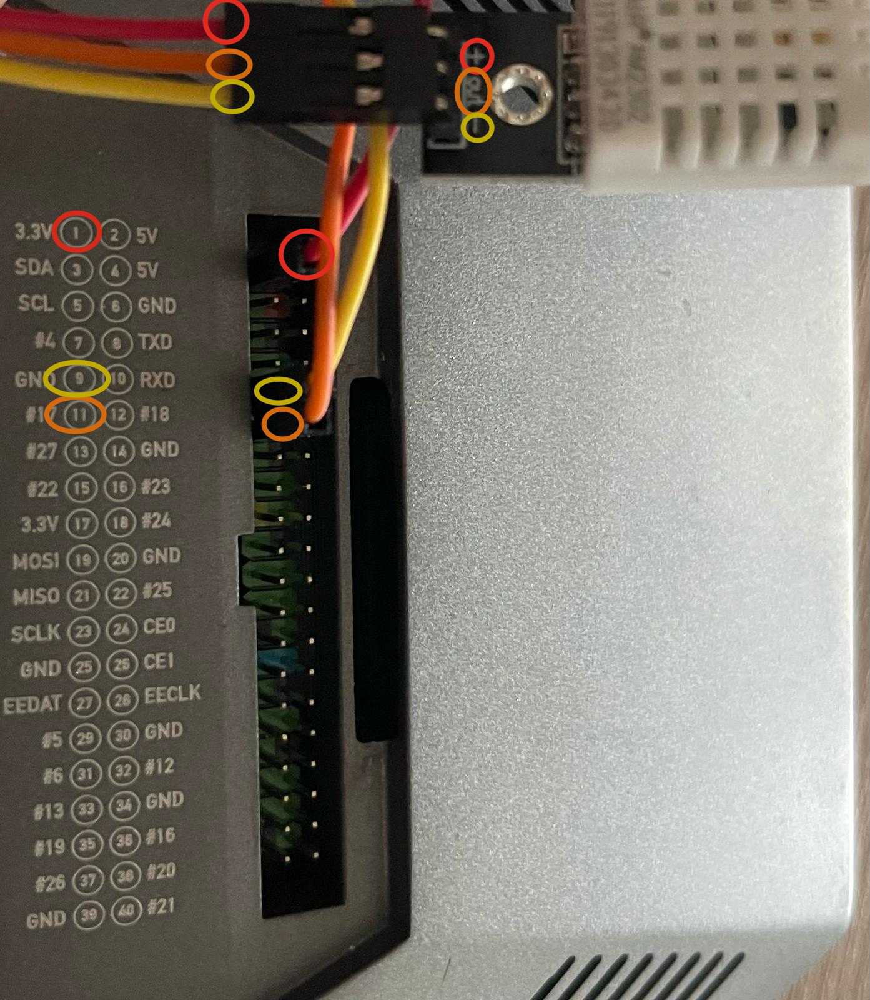

# FaaS IoT Demo cwcloud

## Wiring of the Sensor PI



## Requirements

On both rapberrypi:

```shell
sudo apt update -y
sudo apt install -y build-essential fonts-noto-color-emoji
```

## On the sensor pi

1. Change the `changeit` value in the [common.json](./common.json) file
2. Run the following commands:

```shell
python3 -m venv ./vdemo
./vdemo/bin/pip install --upgrade pip setuptools wheel
./vdemo/bin/pip install -r sensor.requirements
./vdemo/bin/python sensor.py
```

## On the screen pi

```shell
python3 -m venv ./vdemo
./vdemo/bin/pip install --upgrade pip setuptools wheel
./vdemo/bin/pip install -r screen.requirements
./vdemo/bin/python screen.py
```
