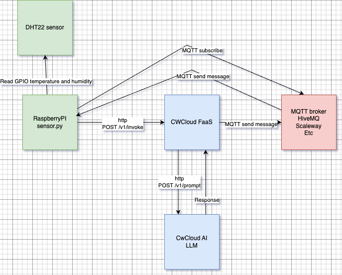
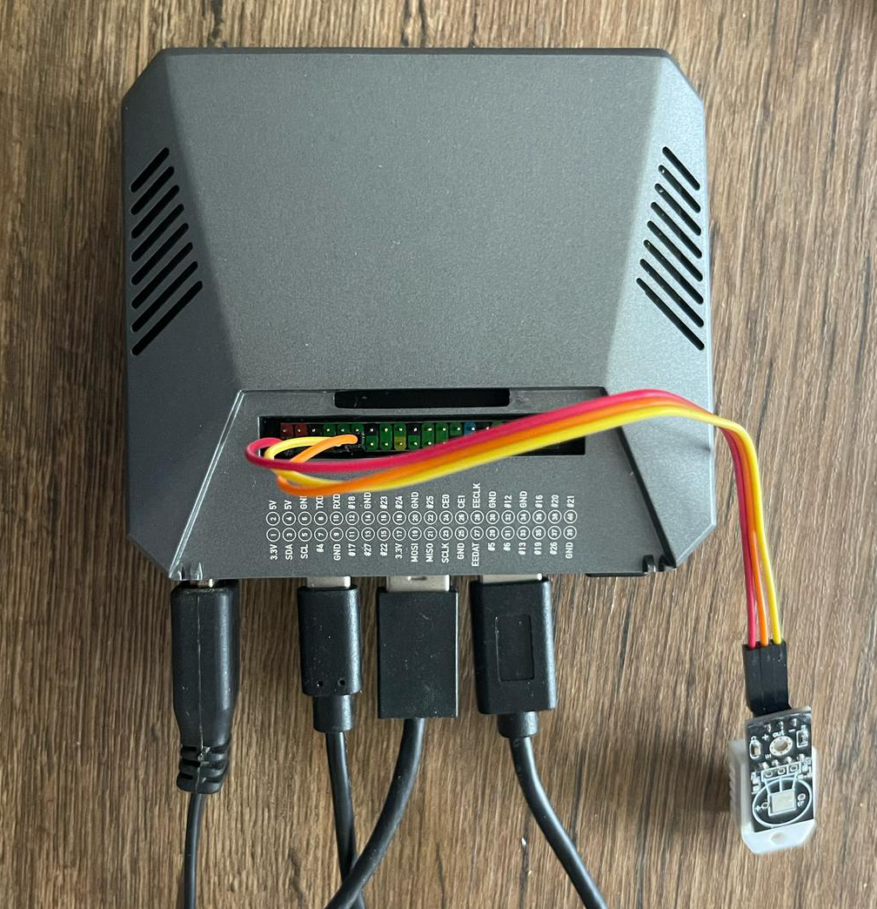

# FaaS IoT Demo cwcloud

This demo is illustrating how to use the the CWCloud FaaS engine with the CW AI api together with a humidity and temperature sensor to get feeling emojis using MQTT.

The function is supposed to send the humidity and temperature to a serverless function which will send this in a prompt to a LLM and tell the LLM to answer with emojis to explain how it feels.

This is the flow:



The expected output is a TC/TK window opened like this on the raspberrypi each time it receive the answer of the serverless function via MQTT:


Relevant tutorials:
* [using CW AI with the FaaS engine](https://www.cwcloud.tech/docs/tutorials/cwai#using-the-faas-engine)
* [Adding MQTT callbacks in your serverless function](https://www.cwcloud.tech/docs/tutorials/faas/how_to_create_mqtt_hive_mq#step-2-add-an-mqtt-callback-and-create-your-function)

## Requirements

### Hardware

You need a RaspberryPi 4 model B with 4GB ram or more:



And a DHT22 temperature and humidity sensor wired as described below:


* `+` plugged in pin 1 (`3.3V`)
* `out` plugged in pin 11 (`#17`)
* `-` plugged in pin 9 (`GND`)

Note: this wiring is working also when you're using an ArgoOne case which is also using some other pins for its fan.

### Software

Packages to install:

```shell
sudo apt update -y
sudo apt dist-upgrade -y
sudo apt autoremove -y
sudo apt install -y git build-essential fonts-noto-color-emoji python3-tk x11-apps
```

If you want to use the [gitlab CI pipeline](./.gitlab-ci.yml), also install gitlab runner:

```shell
curl -L "https://packages.gitlab.com/install/repositories/runner/gitlab-runner/script.deb.sh" | sudo bash
sudo apt -y install gitlab-runner
gitlab-runner register
```

## Run and update the code manually

### Run the sensor code

1. Change the values containing `changeit` value in the configurations json files: [common.json](./common.json) and [sensor.json](./sensor.json)
2. Run the following commands:

```shell
python3 -m venv ./vdemo
source ./vdemo/bin/activate
./vdemo/bin/pip install --upgrade pip setuptools wheel
./vdemo/bin/pip install -r sensor.requirements
./vdemo/bin/python sensor.py
```

### Run the screen code

1. Change the values containing `changeit` value in the configurations json files: [common.json](./common.json) and [screen.json](./screen.json)
2. Run the following commands:

```shell
python3 -m venv ./vdemo
source ./vdemo/bin/activate
./vdemo/bin/pip install --upgrade pip setuptools wheel
./vdemo/bin/pip install -r screen.requirements
./vdemo/bin/python screen.py
```
